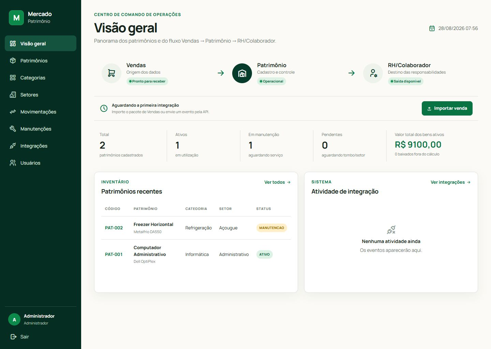
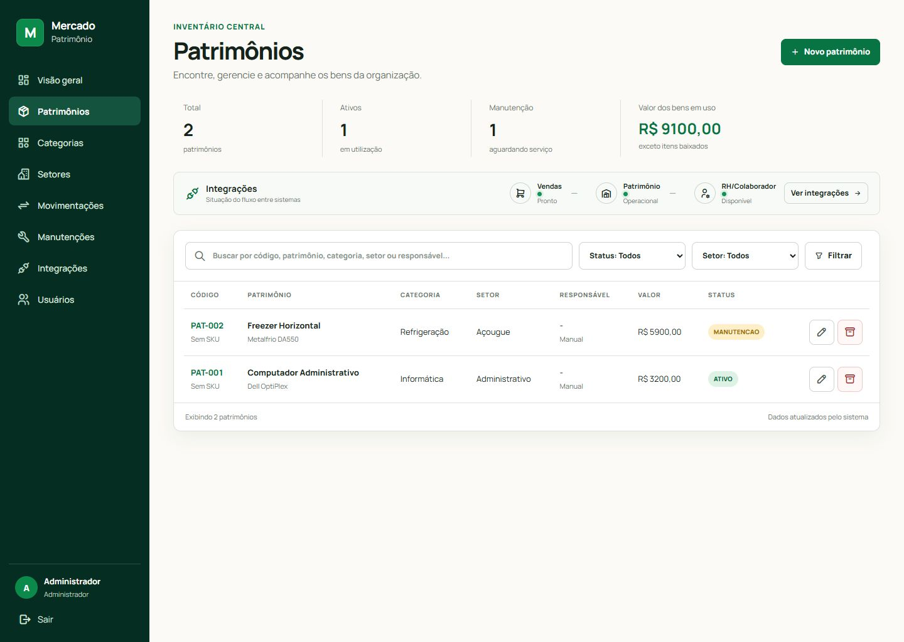
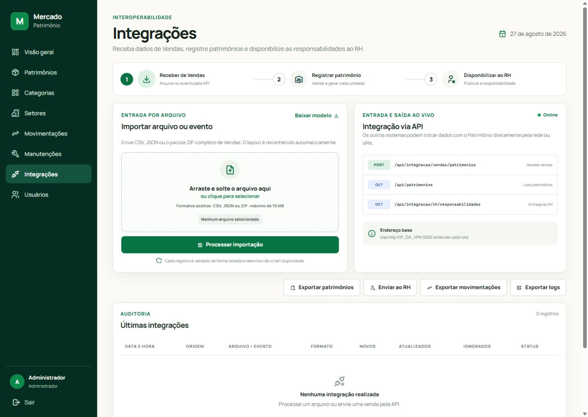

# Patrimônio — Interoperabilidade

Sistema web acadêmico para gestão patrimonial e integração entre os módulos de
Vendas, Patrimônio/SAC e RH/Colaborador. Desenvolvido em Python com Flask e
SQLite, sem depender de serviços externos para executar.



## Papel no projeto integrado

O ciclo combinado pelos grupos é:

```text
Marketing → Estoque → Compras → Financeiro → Vendas
                                              ↓
                               SAC e Patrimônio → RH/Colaborador → Marketing
```

Este repositório implementa o trecho:

```text
Vendas → SAC e Patrimônio → RH/Colaborador
```

Depois que uma venda é faturada, o sistema recebe o produto, cliente e
colaborador responsável. Cada unidade vendida vira um registro patrimonial
vinculado à venda e à garantia. O resultado fica disponível para o RH por API
ou CSV.

## Principais funcionalidades

- Autenticação com perfis de administrador e funcionário.
- Dashboard operacional com o fluxo de integração visível.
- Cadastro, edição, consulta, busca, filtros e baixa de patrimônios.
- Cadastro de categorias, setores e usuários.
- Movimentação de patrimônios entre setores.
- Registro e conclusão de manutenções.
- Importação de CSV, JSON e pacote ZIP de Vendas.
- Importação de produtos e movimentações do Estoque.
- Entrada ao vivo de vendas por API JSON.
- Exportações de patrimônios, movimentações, responsabilidades para RH e logs.
- Idempotência: reenviar o mesmo evento atualiza o registro e não duplica bens.
- Layout responsivo, fonte e ícones armazenados no próprio projeto.

## Telas principais

| Inventário | Integrações |
|---|---|
|  |  |

## Tecnologias

- Python 3.10 ou superior.
- Flask 3.1.1.
- SQLite 3.
- HTML/Jinja, CSS e JavaScript sem framework frontend.
- Manrope Variable, hospedada localmente sob OFL-1.1.
- Tabler Icons Webfont, hospedado localmente sob licença MIT.

## Como clonar e executar

### Windows — forma rápida

```powershell
git clone https://github.com/alessandrabregadioli/patrimonio_Interoperabilidade.git
cd patrimonio_Interoperabilidade
./iniciar.bat
```

O arquivo `iniciar.bat` cria o ambiente virtual, instala as dependências e
inicia o Flask.

### Windows — forma manual

```powershell
git clone https://github.com/alessandrabregadioli/patrimonio_Interoperabilidade.git
cd patrimonio_Interoperabilidade
python -m venv venv
venv\Scripts\Activate.ps1
python -m pip install -r requirements.txt
python app.py
```

### Linux ou macOS

```bash
git clone https://github.com/alessandrabregadioli/patrimonio_Interoperabilidade.git
cd patrimonio_Interoperabilidade
python3 -m venv venv
source venv/bin/activate
python -m pip install -r requirements.txt
python app.py
```

Abra:

```text
http://127.0.0.1:5000
```

O banco `patrimonio.db` é criado automaticamente na primeira execução com dois
patrimônios de demonstração e o usuário inicial.

### Login inicial

```text
E-mail: admin@mercado.com
Senha: 123456
```

## Acesso pela rede ou VPN

O Flask inicia em `0.0.0.0:5000`. Para outro computador acessar, utilize o IP
da máquina que está executando o projeto:

```text
http://IP_DA_MAQUINA:5000
```

Exemplo pela VPN:

```text
http://10.8.0.25:5000
```

Pode ser necessário liberar a porta TCP 5000 no Firewall do Windows. Não envie
`127.0.0.1` aos outros grupos: esse endereço aponta para o próprio computador de
quem o utiliza.

## Integração ao vivo

### Vendas envia ao Patrimônio

```http
POST /api/integracao/vendas/patrimonios
Content-Type: application/json
```

```json
{
  "venda_external_id": "VEN-2026-001",
  "item_external_id": "ITEM-01",
  "produto_sku": "SKU001",
  "produto_nome": "Produto Exemplo",
  "quantidade": 1,
  "valor_unitario": 99.90,
  "data_venda": "2026-08-27",
  "status_venda": "FATURADO",
  "cliente_documento": "12345678901",
  "cliente_nome": "Cliente Exemplo",
  "colaborador_external_id": "COL-001",
  "colaborador_nome": "Ana Souza",
  "garantia_ate": "2027-08-27"
}
```

Também é possível enviar uma lista de vendas ou um objeto com a propriedade
`vendas`.

### Outros sistemas consultam patrimônios

```http
GET /api/patrimonios
GET /api/integracao/vendas/patrimonios
```

### RH consulta responsabilidades

```http
GET /api/integracao/rh/responsabilidades
```

Use o endereço completo, por exemplo:

```text
http://10.8.0.25:5000/api/integracao/rh/responsabilidades
```

## Integração por arquivos

No menu **Integrações**, o sistema reconhece automaticamente:

1. CSV consolidado de Vendas com venda, produto, cliente e colaborador.
2. ZIP de Vendas contendo clientes, vendedores, produtos, pedidos e itens.
3. `produtos.csv` do Estoque.
4. `movimentacoes.csv` do Estoque.
5. CSV ou JSON de patrimônio genérico.

Arquivos prontos para demonstração estão em [`exemplos_integracao/`](exemplos_integracao/).
O contrato completo está em
[`DOCUMENTACAO_INTEGRACAO.md`](DOCUMENTACAO_INTEGRACAO.md).

## Exportações

| Rota | Finalidade |
|---|---|
| `GET /exportacao/patrimonios.csv` | Todos os patrimônios. |
| `GET /exportacao/rh_colaboradores.csv` | Eventos de atendimento no modelo oficial do RH. |
| `GET /exportacao/movimentacoes.csv` | Histórico de movimentações. |
| `GET /exportacao/logs.csv` | Auditoria das integrações. |

Os CSVs utilizam cabeçalho e UTF-8 com BOM para abrir corretamente no Excel.
As exportações gerais usam vírgula; `sac_para_rh.csv` usa ponto e vírgula para
seguir o modelo oficial fornecido pelo grupo do RH.

## Como a duplicidade é evitada

Cada unidade recebida é identificada por:

```text
sistema_origem + external_id + unidade_origem
```

Na integração de Vendas, o `external_id` é calculado com a venda e o item. Se o
mesmo conteúdo for enviado novamente, as unidades existentes são atualizadas.

## Estrutura do projeto

```text
.
├── app.py                         # Aplicação, banco, regras, importadores e APIs
├── iniciar.bat                    # Inicialização automática no Windows
├── requirements.txt               # Dependências Python
├── templates/                     # Telas Jinja
├── static/
│   ├── style.css                  # Design responsivo
│   ├── app.js                     # Menu móvel e upload por arrastar/soltar
│   └── vendor/                    # Fonte, ícones e respectivas licenças
├── exemplos_integracao/           # CSVs e ZIP para testes
├── DOCUMENTACAO_INTEGRACAO.md     # Contratos entre os grupos
├── ARQUITETURA.md                 # Decisões técnicas e fluxo interno
├── CHANGELOG.md                   # Histórico do trabalho realizado
├── design-qa.md                   # Evidências da validação visual
└── design-references/             # Referências e capturas das telas
```

## Testes realizados

Para repetir os testes automatizados:

```powershell
python -m unittest discover -s tests -v
```

- Pacote ZIP real de Vendas criando dez unidades patrimoniais.
- CSV consolidado de Vendas criando duas unidades.
- POST da API de Vendas criando uma unidade.
- Reimportação dos três formatos sem duplicidade.
- Exportação para RH e demais CSVs em UTF-8 com BOM.
- Renderização autenticada das dez rotas HTML principais.
- APIs de Patrimônio e RH respondendo normalmente.
- Filtro de patrimônios e menu responsivo funcionando no navegador.
- Verificação visual em 1440 × 1024 e 390 × 844.
- Console do navegador sem erros ou avisos.

O relatório visual completo está em [`design-qa.md`](design-qa.md).

## Observação de segurança

O projeto foi preparado para apresentação acadêmica e uso em rede controlada.
Antes de publicar na internet, altere a chave secreta, troque a senha inicial,
desative o servidor de desenvolvimento e implemente autenticação/autorização na
API.
